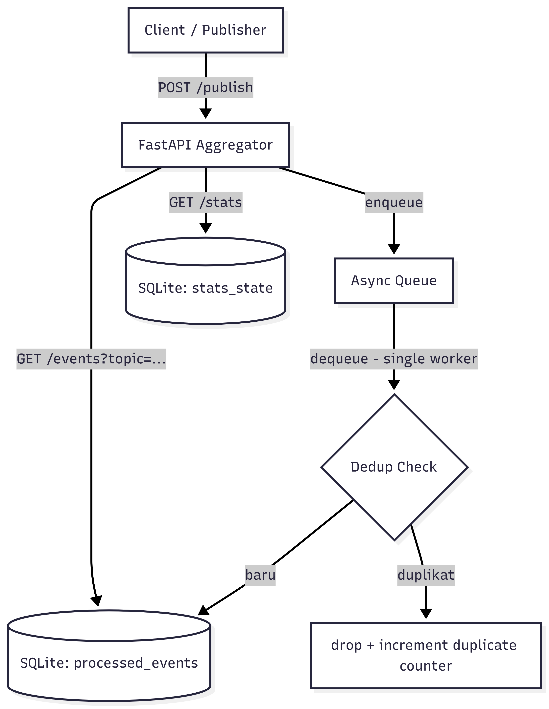

# Ringkasan Sistem dan Arsitektur

Sistem ini adalah log aggregator berbasis FastAPI yang menerima event dari client/publisher melalui endpoint HTTP, lalu memproses event secara asynchronous menggunakan antrian internal. Tujuan utamanya adalah memastikan event hanya diproses sekali (idempotent processing), tetap tahan terhadap event duplikat, dan menyimpan state secara persisten.

Komponen utama:

1. API service (/publish, /stats, /events) sebagai pintu masuk event dan observability.
2. Worker asynchronous berbasis asyncio.Queue untuk proses dedup + penyimpanan di background.
3. Dedup store berbasis SQLite untuk event yang sudah diproses dan statistik kumulatif.
4. Publisher service (opsional di Docker Compose) untuk simulasi traffic/beban.

Arsitektur ini memisahkan jalur ingest HTTP (cepat merespons 202 Accepted) dari jalur persistensi (diproses di background), sehingga publish tidak perlu menunggu operasi database selesai.

**Keterkaitan ke Bab 1–7:**
Pemisahan jalur penerimaan request HTTP dari pemrosesan di latar belakang merupakan penerapan **komunikasi asinkron** (_asynchronous communication_) yang berfungsi untuk menutupi latensi komunikasi jaringan (_hiding communication latencies_) (Tanenbaum & van Steen, 2007, Bab 1, hlm. 12–13). Komponen asyncio.Queue berfungsi layaknya _Message-Oriented Middleware_ (MOM) yang menawarkan penyimpanan persisten sementara agar komponen dapat beroperasi secara independen (Tanenbaum & van Steen, 2007, Bab 4, hlm. 147–148). Selain itu, arsitektur ini menerapkan pola **dispatcher/worker** khas _multithreaded servers_, di mana thread API meneruskan tugas berat (seperti I/O penulisan ke SQLite) kepada worker agar tidak memblokir antarmuka sistem (Tanenbaum & van Steen, 2007, Bab 3, hlm. 77–78).

# Keputusan Desain

## 1. Idempotency

Strategi idempotency dilakukan dengan kunci unik kombinasi topic + event_id.

Alasan:

1. Event log biasanya memiliki identifier dari producer; pasangan topic dan event_id cukup natural sebagai business key.
2. Kombinasi ini memungkinkan event_id yang sama dipakai di topic berbeda tanpa collision.

Implikasi:

1. Pengiriman ulang event yang sama tidak menambah data baru.
2. Endpoint /publish tetap mengembalikan status accepted, tetapi event duplikat akan di-drop di worker.

## 2. Dedup Store

Dedup store menggunakan SQLite dengan tabel processed_events (primary key: topic, event_id) dan stats_state untuk statistik persisten.

Alasan:

1. SQLite cukup untuk beban UTS/prototipe dan mudah dibawa di container.
2. Persistensi file membuat data survive restart container (dengan volume).
3. Konfigurasi WAL (PRAGMA journal_mode = WAL) meningkatkan concurrency read/write antara API dan worker.

Trade-off:

1. Skalabilitas horizontal terbatas dibanding external DB/KV store terdistribusi.
2. Untuk throughput sangat tinggi, SQLite akan jadi bottleneck.

**Keterkaitan ke Bab 1–7 (Idempotency & Dedup Store):**
Kombinasi topic dan event_id bertindak sebagai sebuah **identifier** dalam sistem _flat naming_, yaitu sekumpulan bit/karakter unik yang merujuk tepat pada satu entitas (_event_) dan menghindari adanya tabrakan nama (Tanenbaum & van Steen, 2007, Bab 5, hlm. 181–183). Keputusan untuk membiarkan klien mengirim pesan ulang tanpa merusak _state_ akhir (_idempotency_) adalah landasan vital dalam implementasi **eventual consistency**, di mana perambatan pembaruan yang lambat (_lazy update propagation_) dan kegagalan jaringan sangat mungkin memunculkan duplikasi data (Tanenbaum & van Steen, 2007, Bab 7, hlm. 288–289).

## 3. Ordering

Ordering pada implementasi saat ini:

1. Queue memakai FIFO (asyncio.Queue).
2. Worker tunggal memproses event satu per satu sesuai urutan masuk queue.

Makna praktis:

1. Urutan proses terjaga pada level queue lokal service.
2. Tidak ada jaminan global ordering lintas instance (karena sistem belum multi-instance / distributed queue).

## 4. Retry

Retry diterapkan di lapisan akses SQLite (\_execute_with_retry) khusus saat terjadi lock database (sqlite3.OperationalError: locked).

Karakteristik retry:

1. Maksimum 6 percobaan.
2. Backoff eksponensial mulai 50 ms.
3. Fokus pada transient lock, bukan semua jenis error.

Konsekuensi:

1. Menurunkan risiko gagal tulis saat kontensi sementara.
2. Belum ada retry di sisi HTTP client dalam service aggregator (retry producer menjadi tanggung jawab client/publisher).

**Keterkaitan ke Bab 1–7 (Ordering & Retry):**
Tidak digunakannya _timestamp_ bawaan _event_ dan bergantung pada urutan kedatangan FIFO secara teoretis dipicu oleh ketiadaan jam fisik global yang mutlak (_no global agreement on time_); perbedaan jam fisik pada jaringan klien bisa menyebabkan anomali kronologis yang parah (Tanenbaum & van Steen, 2007, Bab 6, hlm. 238). Mekanisme _retry_ dengan _backoff_ pada antarmuka _database_ adalah salah satu bentuk toleransi kegagalan dan penyembunyian latensi/pemblokiran sementara (_masking failures_) agar sistem keseluruhan tampak terus tersedia (Tanenbaum & van Steen, 2007, Bab 1, hlm. 5).

---

# Analisis Performa dan Metrik

Sumber metrik:

1. Hasil test Docker: 6 passed, 2 warnings in 6.09s.
2. Skenario uji performa di test_stress_small dan test_high_load_performance.

## 1. Throughput

### a) Skenario high-load (5000 event)

Pada test test_high_load_performance, sistem mem-publish total 5000 event (4000 unik, 1000 duplikat) dalam 5 batch (masing-masing 1000 event) dengan batas lolos duration < 40s.
Lower-bound throughput publish path: 125 event/detik.

### b) Skenario small-stress (100 event)

Pada test test_stress_small, 100 request single-event harus selesai di bawah 2 detik.
Lower-bound throughput request: 50 request/detik.

## 2. Latency

Latency yang tersedia dari test saat ini berupa batas atas (upper bound).

1. Small stress: Rata-rata latency request single-event berada di bawah 20 ms/request.
2. High load publish: Rata-rata latency per request batch berada di bawah 8 s/request batch.

## 3. Duplicate Rate

Pada skenario high-load, dari total 5000 event, terdapat 1000 event duplikat, sehingga Duplicate rate = 20%. Dengan mekanisme dedup, duplikat tersebut tidak menambah unique processed event.

**Keterkaitan ke Bab 1–7:**
Dalam sistem terdistribusi, penurunan performa seperti pelambatan _latency_ secara eksponensial di kala lalu lintas _event_ melebihi batas kapasitas SQLite adalah tanda klasik yang menandakan adanya isu **skalabilitas** ukuran (_scalability problems appear in the form of performance degradation_) (Tanenbaum & van Steen, 2007, Bab 1, hlm. 14–15).

---

# Kesimpulan Singkat

Implementasi saat ini sudah memenuhi kebutuhan dasar aggregator untuk:

1. Menerima beban publish batch.
2. Menjaga idempotency berbasis topic + event_id.
3. Memproses event asynchronous dengan ordering FIFO lokal.
4. Mempertahankan state secara persisten.

Untuk tahap lanjut, observability bisa ditingkatkan dengan metrik p95/p99 latency, queue depth, dan success/error rate per endpoint secara real-time.

---

# Daftar Pustaka

Tanenbaum, A. S., & van Steen, M. (2007). _Distributed systems: Principles and paradigms_ (Edisi ke-2). Prentice Hall.
